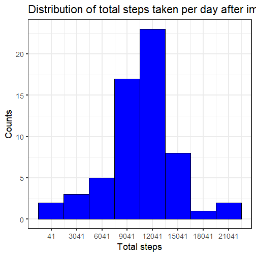
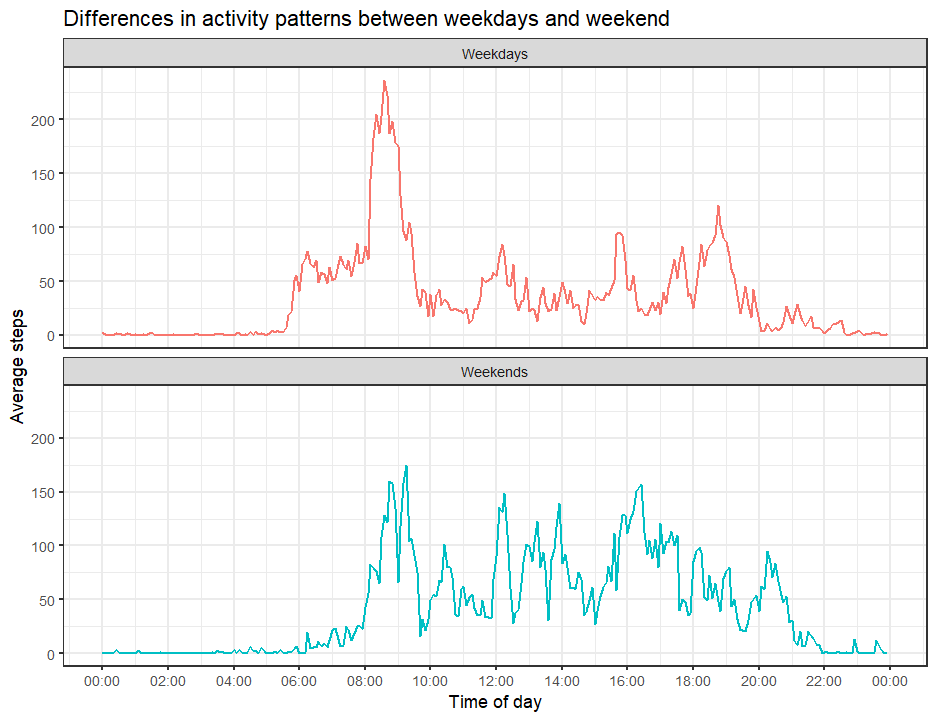

---
title: "Presentation of Activity Monitoring Data"
output: 
  html_document:
    keep_md: true
---  
  
# Rmarkdown File Info  
  
Creation date : 2023-06-26 12:37:00.424316  
Last modification date : 2023-06-27 13:53:31.769175  
Written using R version 4.3.0 (2023-04-21 ucrt) using RStudio IDE  
Packages used : **dplyr** 1.1.2; **ggplot2** 3.4.2  
  
# Introduction

The data for this project was obtained from a personal activity monitoring device. The device collected data at 5 minute intervals through out the day. The data consists of two months of data from an anonymous individual collected during the months of October and November, 2012 and include the number of steps taken in 5 minute intervals each day.  
  
The variables included in the dataset are:  
  
* **steps** : Number of steps taking in a 5-minute interval (missing values are coded as NA)\
* **date** : The date on which the measurement was taken in YYYY-MM-DD format\
* **interval** : Identifier for the 5-minute interval in which measurement was taken, which is coded as hour pf the day as the first number and minutes of the hour as the next 2 numbers, if the value for hour is zero, then it is not included, for eg. 55 corresponds to 00:55 in HH:MM format and the next number 100 represents 01:00 in HH:MM format, or 1435 represents 14:35 in the HH:MM format  
  
The dataset is stored in a comma-separated-value (CSV) file and there are a total of 17,568 observations in this dataset.  
  
## Reference

The data was made available by the instructors of Reproducible Research course for the purposes of peer assessment course project.  
  
# Loading and preprocessing the data

The data set is already present in the repository and can be loaded with the following code and stored in the stepsMonitor object,


```r
stepsMonitor <- read.csv(unz("activity.zip", "activity.csv"), header = TRUE)
head(stepsMonitor)
```

```
##   steps       date interval
## 1    NA 2012-10-01        0
## 2    NA 2012-10-01        5
## 3    NA 2012-10-01       10
## 4    NA 2012-10-01       15
## 5    NA 2012-10-01       20
## 6    NA 2012-10-01       25
```

```r
str(stepsMonitor)
```

```
## 'data.frame':	17568 obs. of  3 variables:
##  $ steps   : int  NA NA NA NA NA NA NA NA NA NA ...
##  $ date    : chr  "2012-10-01" "2012-10-01" "2012-10-01" "2012-10-01" ...
##  $ interval: int  0 5 10 15 20 25 30 35 40 45 ...
```
  
Processing of data was done in the following steps,  
  
1. **Converting date column into the date class**

```r
stepsMonitor$date <- as.Date(stepsMonitor$date)
```
2. **Adding one more column for weekdays corresponding to the dates**  

```r
stepsMonitor$weekdays <- weekdays(stepsMonitor$date)
```
3. **Creating 2 tables from the data**  
    + Summarize the total number of steps per day, NAs are ignored
    
    ```r
    if(system.file(package = "dplyr") == "") install.packages("dplyr")
    library(dplyr)
    stepsbyday <- summarize(stepsMonitor,
                        total = sum(steps, na.rm = TRUE),
                        .by = "date")
    ```
    + Summarize the average number of steps for each 5 min interval, NAs are ignored
    
    ```r
    stepsbyinterval <- summarize(stepsMonitor,
                             average = mean(steps, na.rm = TRUE),
                             .by = "interval")
    ```
    This new data set is changed further by,  
    Adding another column which represents the time of day
    
    ```r
    stepsbyinterval$time <- seq(0,1439,5) * 60 #Creates a vector of seconds since 12am
    ```
    and then converting it into a POSIXct class to represent time of day.  
    Date and timezone are just place holders, since this data frame contains average across each day.  
    
    ```r
    stepsbyinterval$time <- as.POSIXct(stepsbyinterval$time, tz = "UTC")
    ```
  
Thus, the data sets post processing include the following,  
**stepsMonitor** : Contains the collected data

```r
str(stepsMonitor)
```

```
## 'data.frame':	17568 obs. of  4 variables:
##  $ steps   : int  NA NA NA NA NA NA NA NA NA NA ...
##  $ date    : Date, format: "2012-10-01" "2012-10-01" "2012-10-01" ...
##  $ interval: int  0 5 10 15 20 25 30 35 40 45 ...
##  $ weekdays: chr  "Monday" "Monday" "Monday" "Monday" ...
```

```r
head(stepsMonitor)
```

```
##   steps       date interval weekdays
## 1    NA 2012-10-01        0   Monday
## 2    NA 2012-10-01        5   Monday
## 3    NA 2012-10-01       10   Monday
## 4    NA 2012-10-01       15   Monday
## 5    NA 2012-10-01       20   Monday
## 6    NA 2012-10-01       25   Monday
```
**stepsbyday** : Contains the total steps per day with NAs ignored

```r
str(stepsbyday)
```

```
## 'data.frame':	61 obs. of  2 variables:
##  $ date : Date, format: "2012-10-01" "2012-10-02" "2012-10-03" ...
##  $ total: int  0 126 11352 12116 13294 15420 11015 0 12811 9900 ...
```

```r
head(stepsbyday)
```

```
##         date total
## 1 2012-10-01     0
## 2 2012-10-02   126
## 3 2012-10-03 11352
## 4 2012-10-04 12116
## 5 2012-10-05 13294
## 6 2012-10-06 15420
```
**stepsbyinterval** : Contains the average steps for each 5 minute interval averaged across all days  

```r
str(stepsbyinterval)
```

```
## 'data.frame':	288 obs. of  3 variables:
##  $ interval: int  0 5 10 15 20 25 30 35 40 45 ...
##  $ average : num  1.717 0.3396 0.1321 0.1509 0.0755 ...
##  $ time    : POSIXct, format: "1970-01-01 00:00:00" "1970-01-01 00:05:00" "1970-01-01 00:10:00" ...
```

```r
head(stepsbyinterval)
```

```
##   interval   average                time
## 1        0 1.7169811 1970-01-01 00:00:00
## 2        5 0.3396226 1970-01-01 00:05:00
## 3       10 0.1320755 1970-01-01 00:10:00
## 4       15 0.1509434 1970-01-01 00:15:00
## 5       20 0.0754717 1970-01-01 00:20:00
## 6       25 2.0943396 1970-01-01 00:25:00
```
  
# What is mean total number of steps taken per day?  
  

```r
if(system.file(package = "ggplot2") == "") install.packages("ggplot2")
library(ggplot2)
print(ggplot(stepsbyday, aes(total)) +
    # Plots the histogram
    geom_histogram(binwidth = 3000, fill = "blue", color = "black") +
    # Matches the scale ticks to breaks of histogram
    scale_x_continuous(breaks = seq(min(stepsbyday$total),max(stepsbyday$total), 3000)) +
    # Adds descriptive title and labels to the axes
    labs(title = "Distribution of total steps taken per day", x ="Total steps",
         y = "Counts") +
    # Changes the theme to black and white and increases the font size
    theme_bw(base_size = 18))
```


  
Summary of total number of steps taken per day:  

```r
summary(stepsbyday$total)
```

```
##    Min. 1st Qu.  Median    Mean 3rd Qu.    Max. 
##       0    6778   10395    9354   12811   21194
```
  
# What is the average daily activity pattern?  
  

```r
ggplot(stepsbyinterval, aes(time, average)) +
    # Plots the time series data
    geom_line(color = "#00B0F6", linewidth = 1) +
    # Changes the x axis ticks to appear every 2 hours and only display HH:MM
    scale_x_datetime(date_breaks = "2 hour", date_labels = "%H:%M") +
    # Adds descriptive title and labels to axes
    labs(title = "Average daily activity pattern", x ="Time of day",
         y = "Average steps") +
    # Changes the theme to black and white and increases the font size
    theme_bw(base_size = 18)
```


  
5-min Interval with maximum number of steps on average:

```r
maxStepsind <- which.max(stepsbyinterval$average)
cat(paste0("5-min interval identifier : ",stepsbyinterval$interval[maxStepsind],
           "\nTime of day : ",format(stepsbyinterval$time[maxStepsind], "%H:%M")))
```

```
## 5-min interval identifier : 835
## Time of day : 08:35
```
  
# Imputing missing values  
  
Total number of rows with missing values : 2304  
Thus, missing values account for nearly 13.11% of the data, which is a large percentage and a strategy needs to be formulated to deal with the missing data instead of just ignoring the days and times for which data is missing.  
  
## Strategy used for imputing missing values
**Replace the missing values with the average steps taken for matching day of the week AND the 5-minute interval**  
The steps involved are,  
  
1. Find out average steps taken for each combination of weekday and 5 minute interval

```r
stepsbyWeekdayandInterval <- summarize(stepsMonitor,
                                       average = mean(steps, na.rm = TRUE),
                                       .by = c("weekdays", "interval"))
```
2. Creating the imputed data set

```r
ImputedStepsMonitor <- stepsMonitor
```
3. Imputing the missing values with the mean matching weekday AND 5 min interval rounded to the nearest whole number since number of steps cannot be in fractions

```r
ImputedStepsMonitor$steps <- round(mapply(
    function(steps, weekday, interval) {
    if(is.na(steps)) {
        steps <- stepsbyWeekdayandInterval$average[
            which(stepsbyWeekdayandInterval$weekdays == weekday &
                      stepsbyWeekdayandInterval$interval == interval)]
    }
        else {steps}
}, ImputedStepsMonitor$steps,
ImputedStepsMonitor$weekdays,
ImputedStepsMonitor$interval))
```
  
## Imputed data set  
The imputed data set appears as follows and has the same dimensions as the original data set  

```r
head(ImputedStepsMonitor)
```

```
##   steps       date interval weekdays
## 1     1 2012-10-01        0   Monday
## 2     0 2012-10-01        5   Monday
## 3     0 2012-10-01       10   Monday
## 4     0 2012-10-01       15   Monday
## 5     0 2012-10-01       20   Monday
## 6     5 2012-10-01       25   Monday
```

```r
str(ImputedStepsMonitor)
```

```
## 'data.frame':	17568 obs. of  4 variables:
##  $ steps   : num  1 0 0 0 0 5 0 0 0 0 ...
##  $ date    : Date, format: "2012-10-01" "2012-10-01" "2012-10-01" ...
##  $ interval: int  0 5 10 15 20 25 30 35 40 45 ...
##  $ weekdays: chr  "Monday" "Monday" "Monday" "Monday" ...
```
Dimensions of original data set : 17568, 4  
Dimensions of imputed data set : 17568, 4  
Number of rows with missing values in the imputed data set : 0
  
## Changes in the histogram and mean and median of total steps per day after imputatation of missing values  

```r
# summarizes the total number of steps for each day
Imputedstepsbyday <- summarise(ImputedStepsMonitor,
                        total = sum(steps),
                        .by = "date")

# Histogram of total number of steps taken each day
print(ggplot(Imputedstepsbyday, aes(total)) +
    # Plots the histogram
    geom_histogram(binwidth = 3000, fill = "blue", color = "black") +
    # Matches the scale ticks to breaks of histogram
    scale_x_continuous(breaks = seq(min(Imputedstepsbyday$total),
                                    max(Imputedstepsbyday$total), 3000)) +
    # Adds descriptive title and labels to the axes
    labs(title = "Distribution of total steps taken per day after imputation",
         x ="Total steps",
         y = "Counts") +
    # Changes the theme to black and white and increases the font size
    theme_bw(base_size = 18))
```


  
Summary of total number of steps taken per day after imputation:  

```r
summary(Imputedstepsbyday$total)
```

```
##    Min. 1st Qu.  Median    Mean 3rd Qu.    Max. 
##      41    8918   11015   10821   12811   21194
```
  
Imputing the missing data impacted the total number of steps taken per day in the following manner,  
  
\* Average of total number of steps increased  
\* Median of total number of steps increased  
\* The minimum total number of steps taken per day are now non-zero and thus a confirmation of the imputation since the minimum total number of steps was most likely the result of the missing values  
\* The data distribution shifted to the right without any changes in 3rd Quantile or the max total number of steps per day  
  
# Are there differences in activity patterns between weekdays and weekends?  
  
The following processing steps on the imputed data set need to be done before answering the question,  
  
1. **Creating a new factor variable with 2 levels, weekdays and weekends**

```r
ImputedStepsMonitor <- ImputedStepsMonitor %>%
    mutate(weekdays = ifelse(weekdays %in% c("Saturday", "Sunday"),
                             "Weekends", "Weekdays")) %>%
    mutate(weekdays = as.factor(weekdays))
```
2. **Summarizing the average number of steps for each 5 min interval averaged over weekday days or weekend days**

```r
Imputedstepsbyinterval <- summarize(ImputedStepsMonitor,
                             average = mean(steps),
                             .by = c("interval", "weekdays"))
# Adding another column to this which represents the time of day
Imputedstepsbyinterval$time <- seq(0,1439,5) * 60 #Creates a vector of seconds since 12am
# Convert it into a POSIXct class to represent time
# Date and timezone are just place holders, since this data frame contains average across each day
Imputedstepsbyinterval$time <- as.POSIXct(stepsbyinterval$time, tz = "UTC")
```
  

```r
ggplot(Imputedstepsbyinterval, aes(time, average, color = weekdays)) +
    # Plots the time series data
    geom_line(linewidth = 1) +
    # Separates the weekdays and weekends time series into separate panels
    facet_wrap(~weekdays, nrow = 2) +
    # Changes the x axis ticks to appear every 2 hours and only display HH:MM
    scale_x_datetime(date_breaks = "2 hour", date_labels = "%H:%M") +
    # Adds descriptive title and labels to axes
    labs(title = "Differences in activity patterns between weekdays and weekend",
         x ="Time of day",
         y = "Average steps") +
    # Changes the theme to black and white and increases the font size
    theme_bw(base_size = 18) +
    # Removes the legend
    theme(legend.position = "none")
```


  
